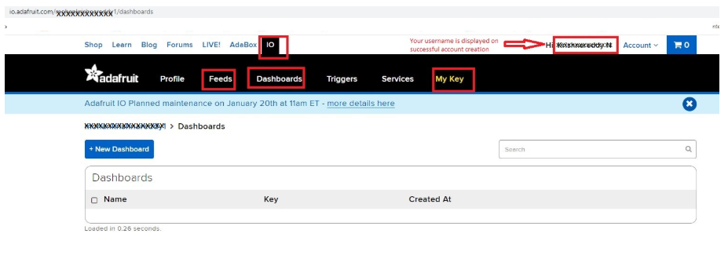
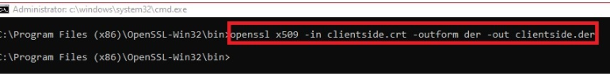

# Verifying Operation
Import, Build and Debug the project in e2studio. As soon as the project is running, open **J-Link RTT Viewer**:

.png)

.png)

Below image show the adafruit server with feed data:

# Special Topics

### Obtaining Adafruit Credentials:
Following steps guide you how to obtain the username and AIO key.
- Go to https://io.adafruit.com. Click on Get Started for Free option as shown in the below image

- Create an account by providing the requested details to obtain user credintails viz., username and password.

- After successful creation of account, user name will display on top of the page as shown in below image. Click on IO, dashboard will displays with the following options Feeds , Dashboards, My key etc.

- Click on My Key option to see your username and Active key. These two details are important for communicating with adafruit server. If the key is compromised, we can generate the new key by clicking on the Regenerate key option as shown in below image.

- After obtaining the user name and io key. User has to update the following details at respective url macros in the aws_https_client_ep/src/user_app.h file as shown in the below image.

### Obtaining Server Certificate:
- Open browser and copy paste the following url http://cacerts.geotrust.com/GeoTrustRSACA2018.crt. Server certificate with .crt extension will be downloaded with the file name GeoTrustRSACA2018.crt

- After downloaded the .crt file, need to be convert to .pem format using OpenSSL.

- OpenSSL can be downloaded from https://www.openssl.org/source/. depends on the Operating System, required installer can be downloaded and installed.

- Copy the downloaded certificate to the bin folder of your installed openssl.

- Open the cmd prompt in Administrator mode from the bin folder as shown in the below image.

- Type the conversion command :Openssl.exe x509 -inform DER -outform PEM -in GeoTrustRSACA2018.crt -out GeoTrustRSACA2018.crt.pem as shown below image

- GeoTrustRSACA2018.crt.pem file will be generated in your bin folder as shown in below image.

- Open the converted certificate file with notepad and copy the content and update in the aws_https_client_ep\src\usr_app.h file at the HTTPS_TRUSTED_ROOT_CA macro as shown in below image.

### Obtaining Client Certificate and Private Key:
- Open the cmd prompt from the bin folder of installed Openssl.

- To generate the private key and CSR certificate use the command openssl req -newkey rsa:2048 -nodes -keyout clientside.key -x509 -days 365 -out clientside.crt as shown below. NOTE: Output file can be any name.

- clientside.key and clientside.crt files are generated in binary folder. Verify client certificate is properly generated by using command openssl x509 -text -noout -in clientside.crt as shown below.

- Generated client certificate is in .crt format. It has to be converted to .pem format. Conversion can be done from .crt to .der and then .der to .pem. To convert from .crt to .der, Use the command openssl x509 -in clientside.crt -outform der -out clientside.der as shown below.

- To convert .der to .pem use the command openssl x509 -in clientside.crt -outform der -out clientside.der as shown below.

- The generated files can be found in bin folder of OpenSSL installed software as shown in below image.

- Open the generated files in notepad and copy the content and paste in the aws_https_client_ep/src/usr_app.h

i. Copied client certificate to be update at the CLIENT_CERTIFICATE_PEM macro as shown in below image.

ii. Copied client key to be update at the CLIENT_KEY_PEM macro as shown in below image.

**NOTE:** Client Certificate and client Key are required for application to authenticate server in secure connection. If missing of both, then it cannot be connect to server instead return an error as no certificates were found.

